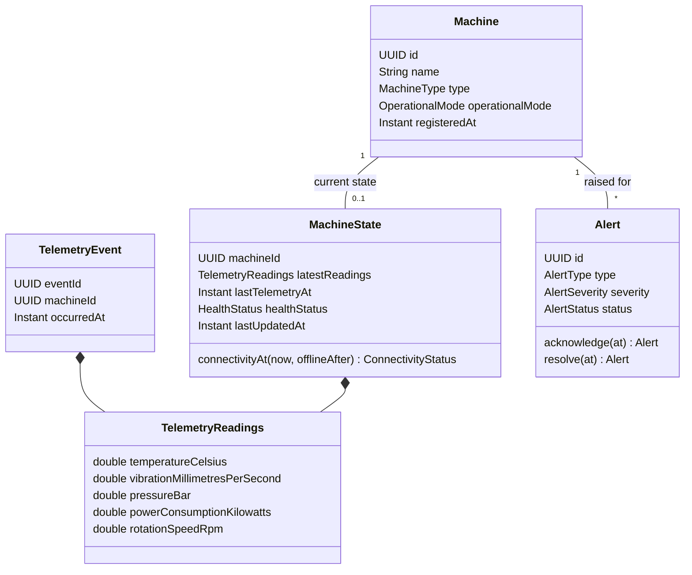
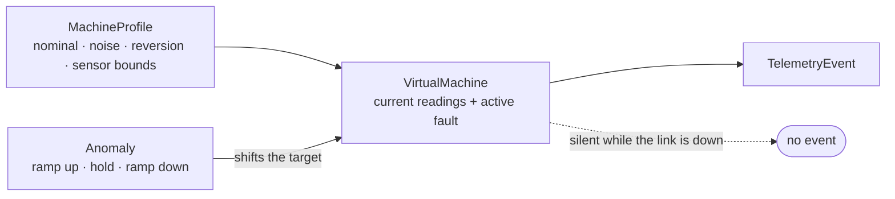
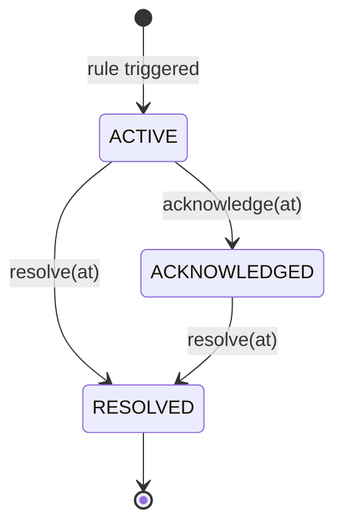

# Sentinel

**Real-Time Industrial Monitoring Platform** — Java 21 · Spring Boot · Kafka · Angular

> **Project status: Milestone 2 — Telemetry simulator.**
> This README documents only what exists in the repository today. Everything else lives in
> the [Roadmap](#roadmap) until it is actually implemented. No performance figure will appear
> here unless it comes from a real measured run.

---

## Overview

Sentinel supervises a fleet of industrial machines. Machines continuously emit telemetry
(temperature, vibration, pressure, power consumption, rotation speed). The platform ingests
that stream, maintains each machine's current state, persists history, detects abnormal
behaviour through a rule engine, manages the alert lifecycle, and pushes changes in real time
to an operator dashboard.

The design goal is an event-driven system that stays correct under duplication, retries and
partial outages — not a CRUD application with a message broker bolted on.

---

## Target architecture

```text
                   ┌─────────────────────┐
                   │  Machine Simulator  │
                   └──────────┬──────────┘
                              │ Telemetry
                              ▼
                   ┌─────────────────────┐
                   │        Kafka        │   keyed by machineId
                   └──────────┬──────────┘
                              ▼
                 ┌─────────────────────────┐
                 │     Sentinel Backend    │
                 │   Java 21 / Spring Boot │
                 └────────────┬────────────┘
         ┌────────────────────┼────────────────────┐
         ▼                    ▼                    ▼
┌────────────────┐   ┌────────────────┐   ┌────────────────┐
│     Redis      │   │   PostgreSQL   │   │  Alert Engine  │
│ current state  │   │    history     │   │     rules      │
└────────────────┘   └────────────────┘   └───────┬────────┘
                                                  ▼
                                          REST API + WebSocket
                                                  ▼
                                        ┌───────────────────┐
                                        │ Angular Dashboard │
                                        └───────────────────┘
```

**Implemented today:** the Spring Boot application shell and its health surface, the
PostgreSQL / Kafka / Redis containers, and the [domain model](#domain-model) with its rule
engine. Nothing is wired to the data path yet — no ingestion, no persistence, no transport.

The backend is a **modular monolith**: one deployable, with domains separated by package
(`machine`, `telemetry`, `alert`, `rule`, `realtime`, `security`, …). This keeps transactional
consistency simple while the boundaries stay explicit enough to split later if a genuine
scaling or ownership reason appears.

---

## Technology stack

| Layer | Technology | Status |
|---|---|---|
| Language | Java 21 (Temurin) | in use |
| Framework | Spring Boot 3.5.16 (Web, Actuator) | in use |
| Build | Maven 3.9.16 via wrapper | in use |
| Database | PostgreSQL 16 | container provisioned |
| Streaming | Apache Kafka 3.9 (KRaft) | container provisioned |
| Cache / state | Redis 7 | container provisioned |
| Tests | JUnit 5, Spring Boot Test, MockMvc | in use |
| CI | GitHub Actions | in use |
| Frontend | Angular | not started (M8) |

Dependencies are added by the milestone that needs them. There is deliberately no JPA, Kafka
or Redis client on the backend classpath yet — which is why the test suite runs green with no
container running.

---

## Running locally

### Prerequisites

- **JDK 21** — the build enforces it and fails fast on anything older
- **Docker** with Compose v2 (only needed for the infrastructure, not for the build)

If JDK 21 is not your default JVM, point the build at it explicitly:

```bash
export JAVA_HOME=$(/usr/libexec/java_home -v 21)   # macOS
java -version                                       # expect 21.x
```

### Infrastructure

```bash
cp .env.example .env
docker compose up -d --wait
docker compose ps          # postgres, redis and kafka should report healthy
```

### Backend

```bash
cd backend
./mvnw clean verify        # compile + tests
./mvnw spring-boot:run     # starts on http://localhost:8080
```

### Verify it is up

```bash
curl -s localhost:8080/api/v1/system/health
# {"status":"UP","application":"sentinel","version":"0.1.0-SNAPSHOT","timestamp":"..."}

curl -s localhost:8080/actuator/health
# {"status":"UP"}
```

### Shut down

```bash
docker compose down          # keeps volumes
docker compose down -v       # also drops the data
```

---

## Configuration

Configuration comes from environment variables, with development defaults baked in so the
project starts with no setup. Copy `.env.example` to `.env` to override. **`.env` is
gitignored — no real credential is ever committed.**

| Variable | Default | Used by |
|---|---|---|
| `SERVER_PORT` | `8080` | backend |
| `DB_HOST` / `DB_PORT` | `localhost` / `5432` | PostgreSQL container |
| `DB_NAME` / `DB_USER` / `DB_PASSWORD` | `sentinel` | PostgreSQL container |
| `KAFKA_BOOTSTRAP_SERVERS` | `localhost:9092` | Kafka container |
| `REDIS_HOST` / `REDIS_PORT` | `localhost` / `6379` | Redis container |

The database, Kafka and Redis variables currently configure the containers only; the backend
starts consuming them when the corresponding milestone lands.

### Kafka listeners

Kafka advertises two listeners because one hostname cannot be valid both inside and outside
the Docker network:

| From | Address |
|---|---|
| Host (IDE, local backend, tests) | `localhost:9092` |
| Another container on the `sentinel` network | `kafka:29092` |

Topic auto-creation is **disabled**: partition count and retention are architectural
decisions, so topics get declared explicitly rather than appearing by accident.

---

## Domain model

The domain is plain Java with no framework annotations, no persistence types and no Spring
dependency. It can be exercised entirely with unit tests and no running infrastructure.



**`Machine` and `MachineState` are separate objects**, split along how often they change: the
registry entry changes when an operator edits the fleet, the state changes on every event.
Merging them would rewrite a low-volume relational row on every telemetry sample.

**Machine status is three orthogonal enums, not one.** `ConnectivityStatus` (is telemetry
arriving?), `HealthStatus` (is the equipment behaving?) and `OperationalMode` (is it under
supervision?) vary independently — a single enum forces a machine that goes quiet while critical
to forget it was critical. `ConnectivityStatus` is *derived* from `lastTelemetryAt` rather than
stored, so it can never go stale and needs no periodic sweep to stay accurate; `HealthStatus` is
stored, because it is the outcome of a rule evaluation rather than a function of the clock.
Full reasoning in [ADR-001](docs/adr/ADR-001-machine-state-modelling.md).

**Structurally invalid is not the same as abnormal.** `TelemetryReadings` rejects only what
cannot physically exist — a NaN, a negative rotation speed, a temperature below absolute zero.
A reading of 140 °C is accepted, because it is a valid measurement describing a machine in
trouble, and discarding it would throw away exactly what the platform exists to detect.

**`MachineState.apply` ignores events that are not strictly newer** than the current state.
Kafka preserves order within a partition and telemetry is keyed by machine, but that guarantee
does not survive a retry or a replay from an earlier offset — and overwriting current readings
with a stale sample is worse than dropping it.

### Rule engine

`RuleEngine` evaluates every configured `Rule` against an `EvaluationContext` and returns the
findings. It creates no alerts: deduplication, cooldown and identity are stateful decisions that
arrive in M6 and will sit on top of this, so naming it `AlertEngine` today would promise
behaviour it does not have.

A rule returns a `RuleResult`, a sealed type with exactly two cases — `Triggered` and
`NotTriggered` — so "nothing found" is a value with a name rather than a `null`, and a `switch`
over the outcome is checked for exhaustiveness by the compiler.

| Rule | Condition | Severity |
|---|---|---|
| `HighTemperatureRule` | `temperature >= 80 °C` / `>= 95 °C` | `WARNING` / `CRITICAL` |
| `ExcessiveVibrationRule` | `vibration >= 8 mm/s` / `>= 14 mm/s` | `WARNING` / `CRITICAL` |
| `AbnormalPressureRule` | outside `[1, 10] bar` | `WARNING` |

Thresholds are constructor arguments with named defaults, never literals inside the comparison,
so a rule can be reconfigured per machine type and tested at its boundaries without being edited.
Comparisons are inclusive: a threshold of 80 means 80 is already a problem, and that convention
is pinned by tests.

Rules are immutable and stateless, so one `RuleEngine` instance is safe to share across every
consumer thread without synchronisation.

## Telemetry simulation

A fleet needs to exist before there is anything to supervise. The simulator generates that fleet
in memory, with no Kafka, no Spring and no dependency on the rule engine — it is a source of
`TelemetryEvent`s, not a component of the alerting path.



**Readings evolve; they are not redrawn.** Each signal follows a discrete mean-reverting process:

```
target = nominal + anomalyOffset
next   = current + reversionRate × (target − current) + gaussianNoise
```

This is an AR(1) process, chosen over a plain random walk for one concrete reason: it is
*stationary*. A walk has unbounded variance and would wander to absurd values over a long run;
the pull toward the target bounds the spread instead of relying on clamping to hide it. A
10 000-tick run is asserted to stay within 10 °C of nominal and to remain centred on it.

**An anomaly shifts the target, not the reading.** Because the reading chases a moving target,
both the climb into a fault and the recovery out of it fall out of that single line of
arithmetic — there is no separate recovery code, and a discontinuous one-tick spike is not
expressible. A fault runs through `DEVELOPING → ACTIVE → RECOVERING → FINISHED`, its strength
following an envelope over its lifetime. A real forced overheat on a `PUMP`:

```
tick   phase          temp
0      healthy        62.2
5      developing     62.6
10     developing     66.8
15     developing     78.8
20     active         91.7
30     active        104.5
50     active        106.4
55     recovering    101.8
60     recovering     91.4
65     recovered      76.8
80     recovered      64.3
95     recovered      62.2
```

**Communication loss is silence, not a reading.** A machine that has lost its link emits nothing
at all. Emitting an event flagged "offline" would be self-defeating, since absence of telemetry
is exactly the evidence `MachineState.connectivityAt` consumes. Internal state keeps evolving
during the outage: the equipment is still running, it just cannot be heard.

**Machine profiles differ by type.** A turbine spins at 9 000 rpm and draws 180 kW; a motor runs
at 1 750 rpm and 22 kW. Every number lives in `MachineProfiles` and nowhere else. Nominal values
sit well inside the default rule bands, because a simulator whose idle state trips the rules
makes every alert meaningless. Sensor bounds are far *outside* those bands, because a signal
clamped at its warning level could never reach critical.

**Everything is reproducible from a seed.** Fleet identity, per-tick noise, fault timing and
fault type all derive from `SimulationConfig.seed`; two runs with the same configuration produce
identical readings. Each machine draws from its own generator split from the master, so growing
the fleet does not perturb the machines already in it. Event identifiers are the deliberate
exception — they come from an injectable supplier defaulting to `UUID.randomUUID()`, because a
producer deriving them from a seed would mint colliding identifiers across two processes, and
event identity is what duplicate detection will rest on.

**Simulated time is not wall-clock time.** `tick()` advances an internal instant and never
sleeps, so a test can fast-forward through a two-minute fault instantly. Real-time scheduling
belongs to whatever drives the engine, not inside it.

The simulator is single-threaded on purpose. Reproducibility is worth more here than throughput,
and nothing has shown generation to be a bottleneck — a local run produced 1 000 000 events in
about 400 ms on one thread, which is far beyond the ingestion rates this project targets.

## Alert lifecycle

An alert is not a mutable status holder. `Alert` is immutable, transitions return a new
instance, and the status can only move through `acknowledge` and `resolve` — which is what keeps
it consistent with its three timestamps.



`ACTIVE → RESOLVED` skips acknowledgment on purpose: a condition that clears before anyone
looked at it is a normal outcome, not something to force through an operator action.

Invalid transitions **throw** rather than being silently ignored:

| Attempt | Behaviour | Why |
|---|---|---|
| Acknowledge an `ACKNOWLEDGED` alert | `InvalidAlertTransitionException` | The second operator would be told they took ownership while the recorded timestamp stays the first one's |
| Acknowledge a `RESOLVED` alert | `InvalidAlertTransitionException` | `RESOLVED` is terminal |
| Resolve a `RESOLVED` alert | `InvalidAlertTransitionException` | Would move the recorded end of an already closed incident |

These are real concurrency outcomes — two operators acting at once, or an operator acknowledging
just as the condition clears. Treating the loser as a success would report an action that never
happened; refusing lets the API answer `409 Conflict`. Callers driving resolution from rule
evaluation should test `isOpen()` rather than use the exception for flow control.

All lifecycle timestamps are passed in, never read from the system clock, so the whole lifecycle
is testable without freezing time globally.

## REST API

Base path `/api/v1`. Only one endpoint exists so far.

| Method | Path | Description |
|---|---|---|
| `GET` | `/api/v1/system/health` | Liveness + build identity of the backend |

`/api/v1/system/health` deliberately coexists with Actuator. Actuator answers *operational
readiness* (dependency health) and becomes internal and authenticated later; the `/api/v1`
endpoint answers *liveness* on the public versioned API — "the backend is reachable, and this
is the build you are talking to" — so it performs no dependency probing and a degraded
database must not make it fail.

---

## Testing

```bash
cd backend && ./mvnw test
```

| Test | What it protects |
|---|---|
| `SentinelApplicationTests` | full context startup — catches a broken bean graph or an unresolvable placeholder |
| `SystemHealthControllerTest` | health contract: HTTP status, JSON shape, and that the build version is really substituted at package time |
| `TelemetryReadingsTest` | the invalid-vs-abnormal boundary: NaN and negatives rejected, 140 °C accepted |
| `AlertTest` | every lifecycle transition, and every refused one |
| `MachineStateTest` | connectivity derivation at its threshold, and stale-event rejection |
| `MachineTest` | registration, maintenance mode, immutability of mutators |
| `HighTemperatureRuleTest`, `ExcessiveVibrationRuleTest`, `AbnormalPressureRuleTest` | threshold behaviour just below, exactly at, and just above each limit |
| `RuleEngineTest` | zero, one and several simultaneous findings; worst-severity health |
| `SimulationEngineTest` | same seed reproduces a run exactly; fleet growth does not perturb existing machines; simulated clock advances by the configured interval |
| `SignalEvolutionTest` | consecutive readings move in small steps, and a 10 000-tick run neither drifts nor leaves nominal range |
| `AnomalyTest`, `AnomalyLifecycleTest` | envelope continuity, the full `DEVELOPING → ACTIVE → RECOVERING → FINISHED` progression, threshold crossing and gradual recovery |
| `ProbabilisticAnomalyTest` | spontaneous faults appear, stay reproducible, and are not restarted while already running |
| `CommunicationLossTest` | a silenced machine emits nothing, keeps evolving, and produces a gap the domain reads as `OFFLINE` |
| `SimulatorRuleIntegrationTest` | a simulated overheat actually drives `HighTemperatureRule` to `CRITICAL` |

The domain is tested with plain JUnit — no `@SpringBootTest`, no mocks. The business objects are
directly instantiable, so there is nothing to stand up and nothing to fake; the only Spring test
in the suite is the M0 bootstrap check. No test requires a running container at this stage.
Testcontainers-based integration tests arrive with persistence (M4).

---

## Engineering decisions

Recorded as they are made, with the reasoning that justified them. Architecture Decision Records
live in [`docs/adr/`](docs/adr/):

- [**ADR-001 — Machine state modelling**](docs/adr/ADR-001-machine-state-modelling.md): why a
  single `MachineStatus` enum was replaced by three orthogonal ones, why `Machine` and
  `MachineState` are separate objects, and why connectivity is derived while health is stored.

Decisions not large enough to warrant their own record:

- **Modular monolith, not microservices.** One deployable with strict package boundaries.
  Splitting a system into services before knowing its real coupling and load profile buys
  distributed-systems problems with no matching benefit.
- **Kafka in KRaft mode.** Removes ZooKeeper from the local stack — one container instead of
  two, and it matches how Kafka is deployed today.
- **No unused dependency on the classpath.** Each starter enters with the milestone that
  exercises it. A dependency that is present but unused is dead weight that still has to be
  patched, and it makes the bootstrap test lie about what the application needs to start.
- **Enforced JDK floor.** `maven-enforcer-plugin` fails the build below JDK 21, which is
  cheaper to diagnose than an unsupported class-file version error deep in the build.
- **No framework annotations in the domain.** No `@Entity`, no `@RedisHash`, no Spring types on
  business objects. Mapping to storage will be explicit at the edges (M4/M5) rather than turning
  the model into a database schema with methods.

---

## Known limitations

At Milestone 2, events can be generated but nothing transports or stores them:

- No ingestion, no persistence, no transport. The rule engine is never invoked at runtime — it
  is exercised only by tests, and no code path yet turns a `RuleResult` into an `Alert`.
- The simulator has no runnable entry point: it is a library driven from tests, with no Spring
  wiring and no scheduler. Making it produce in real time is part of M3.
- Anomaly intensity and duration are fixed per fault type rather than varying across incidents,
  and no fault targets rotation speed.
- The 1 000 000-events-in-~400 ms figure above is a local single-run diagnostic on one machine,
  not a benchmark: no warmed-up harness, no repetitions, no distribution.
- No deduplication, cooldown or lifecycle orchestration; only the transitions themselves are
  enforced (M6).
- Rules are single-sample. Temporal rules ("above 85 °C for 30 seconds") need previous state and
  land later; `EvaluationContext` exists so they can be added without changing rule signatures.
- `MACHINE_OFFLINE` is declared as an alert type but no rule produces it: it is time-driven
  rather than telemetry-driven, and its detection lands with M5.
- Thresholds are per-rule constructor arguments with hardcoded defaults; making them
  configurable per machine type is a later concern.
- The backend does not connect to PostgreSQL, Kafka or Redis — the containers are defined but
  unused.
- **`docker-compose.yml` has never been executed.** It was written and structurally validated,
  but not run: the current Docker Desktop release requires macOS Sonoma and the development
  machine is on Ventura. A Ventura-compatible Docker Desktop version must be installed before
  the milestones that genuinely need Kafka, PostgreSQL, Redis or Testcontainers (M3 onward).
- `/actuator/health` reports only application liveness, since there is no dependency to probe.
- No authentication: every endpoint is currently public (security lands in M12).
- The Docker Compose stack is a single-node development setup — one Kafka broker, no
  replication, no TLS. It is not a production topology.
- CI runs unit tests only; there is no integration-test, lint or Docker build stage yet.

---

## Roadmap

- [x] **M0** — Bootstrap: backend skeleton, infrastructure, CI, health endpoint
- [x] **M1** — Domain model: Machine, TelemetryEvent, MachineState, Alert, rule engine
- [x] **M2** — Telemetry simulator: stateful evolution, machine profiles, persistent anomalies
- [ ] **M3** — Kafka ingestion: serialization, partitioning by `machineId`, consumer groups
- [ ] **M4** — PostgreSQL: Flyway, telemetry history, indexes, Testcontainers
- [ ] **M5** — Redis: current state, last-seen tracking, idempotency
- [ ] **M6** — Alert engine: rules, deduplication, cooldown, lifecycle
- [ ] **M7** — REST API: pagination, filtering, error handling
- [ ] **M8** — Angular bootstrap: shell, routing, Material
- [ ] **M9** — Angular machines: list, filters, detail, telemetry charts
- [ ] **M10** — WebSocket: server broadcasting, client reconnection
- [ ] **M11** — Angular alerts: list, filtering, acknowledgment, live updates
- [ ] **M12** — Security: JWT, `OPERATOR` / `ADMIN` roles, guards, interceptor
- [ ] **M13** — Resilience: retry, backoff, dead-letter queue, failure scenarios
- [ ] **M14** — Observability: Micrometer, Prometheus, Grafana, structured logging
- [ ] **M15** — Load testing: 100 / 1 000 / 10 000 machines, measured
- [ ] **M16** — Advanced: batching, virtual threads, tuning — driven by M15 results
- [ ] **M17** — Portfolio polish: diagrams, ADRs, screenshots, benchmark results

---

## Repository layout

```text
sentinel/
├── backend/                  Spring Boot application (Java 21, Maven)
│   └── src/main/java/com/sentinel/
│       ├── machine/domain/   Machine, MachineState, status enums
│       ├── telemetry/domain/ TelemetryEvent, TelemetryReadings
│       ├── alert/domain/     Alert and its lifecycle
│       ├── rule/domain/      Rule, RuleResult, RuleEngine, rules/
│       ├── simulation/       Virtual fleet, machine profiles, anomaly/
│       └── system/           Health endpoint
├── docs/adr/                 Architecture Decision Records
├── .github/workflows/        CI pipelines
├── docker-compose.yml        Local infrastructure
└── .env.example              Configuration template
```

Each domain module will grow an `infrastructure/` package beside its `domain/` one when it
acquires persistence or messaging (M3 onward). `frontend/`, `simulator/` and `infrastructure/`
appear as the milestones that fill them land — empty scaffolding directories are not committed
ahead of time.
